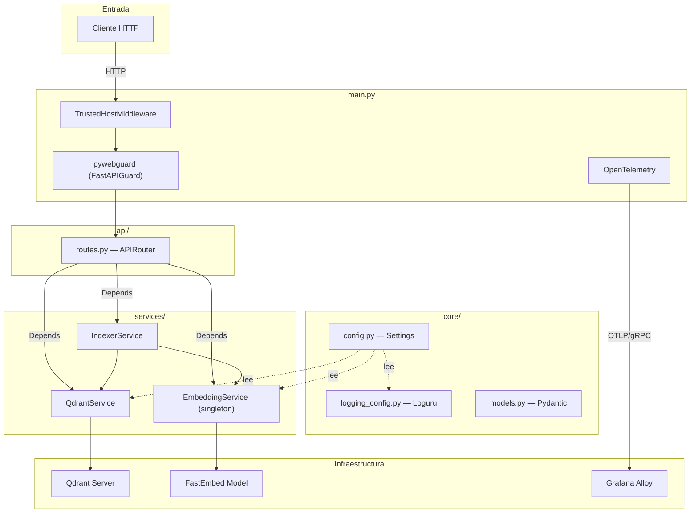
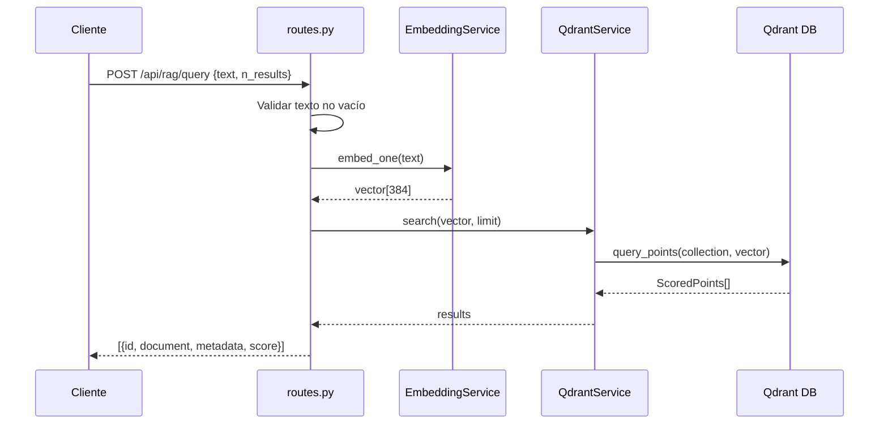
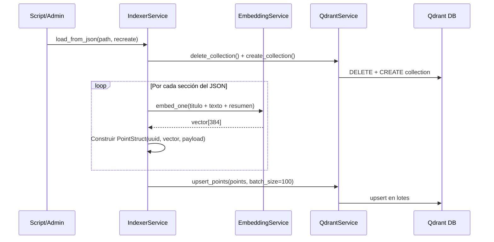

[← Volver al índice](INDEX.md)

# Arquitectura — RAG Service

## Visión general

El servicio sigue una arquitectura de **3 capas** con inyección de dependencias nativa de FastAPI:

```
┌──────────────────────────────────────────────────┐
│                    main.py                       │
│  App FastAPI + Middlewares + Telemetría           │
└────────────────────┬─────────────────────────────┘
                     │
         ┌───────────▼───────────┐
         │      api/routes.py    │   ← Capa de presentación
         │  (Endpoints REST)     │
         └───────────┬───────────┘
                     │ Depends()
    ┌────────────────┼────────────────┐
    ▼                ▼                ▼
┌────────┐   ┌────────────┐   ┌──────────┐
│Embedding│   │  Qdrant    │   │ Indexer  │  ← Capa de servicios
│Service  │   │  Service   │   │ Service  │
└────────┘   └────────────┘   └──────────┘
    │                │
    ▼                ▼
┌────────┐   ┌────────────┐
│FastEmbed│   │  Qdrant DB │   ← Capa de infraestructura
└────────┘   └────────────┘
```

## Diagrama de componentes (Mermaid)



## Módulos

### `main.py` — Punto de entrada

Responsabilidad: Crear la app FastAPI, configurar middlewares y telemetría.

| Componente | Función |
|-----------|---------|
| `configure_telemetry()` | Configura OpenTelemetry (trazas + logs) hacia Alloy vía gRPC |
| `security_config` | Define reglas de pywebguard (IP whitelist, rate limiting) |
| `TrustedHostMiddleware` | Restringe hosts permitidos |

---

### `api/` — Capa de presentación

| Archivo | Responsabilidad |
|---------|----------------|
| `routes.py` | Define todos los endpoints REST bajo el prefijo `/api/rag`. Usa inyección de dependencias de FastAPI para obtener servicios. |

> **Nota para IA:** Los endpoints se documentan en detalle en [API.md](API.md).

---

### `core/` — Configuración y modelos

| Archivo | Responsabilidad |
|---------|----------------|
| `config.py` | Singleton `Settings` que carga `config.yml` y sobrescribe con variables de entorno. Todas las configuraciones se leen desde aquí. |
| `logging_config.py` | Configura Loguru con salida a consola y archivo rotativo. |
| `models.py` | Define `QueryRequest` y `ResultItem` (modelos Pydantic para request/response). |

---

### `services/` — Lógica de negocio

| Archivo | Responsabilidad |
|---------|----------------|
| `embedding_service.py` | Singleton que carga el modelo FastEmbed (lazy init en `__init__` con flag `_initialized`) y expone `embed()` / `embed_one()`. |
| `qdrant_service.py` | CRUD contra Qdrant: crear/eliminar colecciones, upsert de puntos, búsqueda vectorial. |
| `indexer_service.py` | Orquesta la carga de datos: lee JSON → genera embeddings → inserta en Qdrant en lotes. |

---

### `scripts/` — Herramientas CLI

| Archivo | Responsabilidad |
|---------|----------------|
| `load_to_qdrant.py` | Script CLI con `argparse` para carga masiva de datos del corpus a Qdrant. Resuelve la raíz del proyecto dinámicamente para imports absolutos. |
| `enriquecer_curriculum/` | Pipeline de enriquecimiento de secciones educativas (ver su [README](../scripts/enriquecer_curriculum/README.md)). |

---

### `corpus/` — Datos fuente

| Archivo | Responsabilidad |
|---------|----------------|
| `secciones_completas.json` | JSON con secciones educativas de biología (título, texto, resumen, metadatos, curriculum). |

## Flujo de datos: Consulta de búsqueda



## Flujo de datos: Carga de corpus



## Middleware y seguridad

El orden de ejecución de los middlewares es (de afuera hacia adentro):

1. **TrustedHostMiddleware** — Rechaza requests con `Host` no permitido
2. **FastAPIGuard (pywebguard)** — IP whitelist/blacklist + rate limiting (100 req/min, burst 20, auto-ban a 200)

> Para configuración detallada de seguridad, ver la sección `security_config` en `main.py`.

## Observabilidad

| Señal | Transporte | Destino |
|-------|-----------|---------|
| Trazas (traces) | OTLP/gRPC `:4317` | Grafana Alloy |
| Logs | OTLP/gRPC `:4317` | Grafana Alloy |
| Logs locales | Archivo rotativo | `./logs/rag_service.log` |

> **Nota para IA:** La telemetría se configura en `main.py → configure_telemetry()`. El endpoint de Alloy es `alloy:4317` y requiere la red Docker `observability-net`.

---

## Última revisión

- **Fecha:** 2026-06-12
- **Commit:** `(pendiente)`

## Instrucciones para actualizar este doc

- Si añades un nuevo módulo o servicio, agrega una fila en la tabla correspondiente.
- Si cambias el flujo de datos, actualiza los diagramas Mermaid.
- Si modificas middlewares o telemetría, actualiza las secciones respectivas.
- Si cambia la estructura de archivos, actualiza [INDEX.md](INDEX.md).

[← Volver al índice](INDEX.md)
